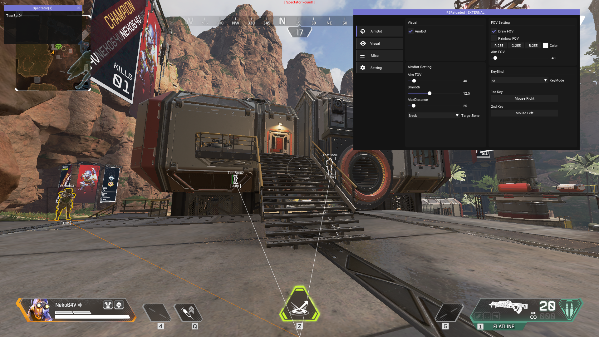

# 概要
高い拡張性と機能性を持つフレームワークの上に構築されたR5Reloaded向けのシンプルな外部チート。

## 機能
* AimBot
* ESP
* NoRecoil
* WeaponCham
* 観戦者リスト

## 実行
必要なライブラリは全て揃っているので、VisualStudioでビルドすれば普通に動くはずです。  
https://learn.microsoft.com/ja-jp/cpp/build/vscpp-step-0-installation?view=msvc-170

## 使用したライブラリ
* Microsoft - SimpleMath  
https://github.com/microsoft/DirectXTK  
* ocornut - ImGui  
https://github.com/ocornut/imgui
* nlohmann - json  
https://github.com/nlohmann/json  

## 免責事項
このプロジェクトは学習や研究・教育用としてアップロードされました。  
これらの用途以外で使用した場合に発生した如何なる損害についても、製作者は一切の責任を負いません。